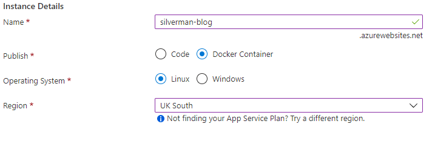
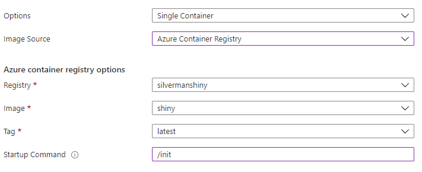
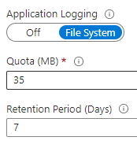
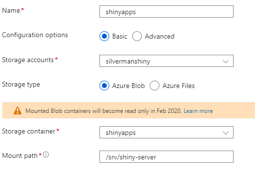

# Taking a Shine to Microsoft Azure

Developing [Shiny](https://github.com/rstudio/shiny) apps can provide a rapid way to share interactive insight with your team.
But making them available in a way that is scalable, secure and yet cost-effective throws up some challenges.

In this blog I will sketch out how Shiny apps can be deployed inside Docker containers, hosted by Microsoft Azure's App Service.

## Preparing the Docker image
The good news is that the good people at Rocker have already done the hard work of putting R and Shiny into a Docker image,
which can be found in the public Docker Hub as [`rocker/shiny`](https://hub.docker.com/r/rocker/shiny).

There are a couple of additions that I would suggest making to this image, in order to work nicely with Microsoft Azure's monitoring and debugging. Referring to Azure's own suggested images, such as that for [Node](https://github.com/Azure-App-Service/node/tree/master/10.14),
you can see that they expose a password-based SSH service, allowing a shell connection to running containers.

This suggested [Dockerfile](Dockerfile) starts from the Rocker image, installs an SSH server with some additional debugging utilities,
and registers the SSH server to launch together with Shiny as a service.  See the comments for more detail!

    # Base image including R/Shiny
    FROM rocker/shiny:4.1.0
    
    # Add additional packages to enable debugging and monitoring
    RUN apt-get update \
        && apt-get install --yes --no-install-recommends openssh-server curl vim less \
        && apt-get clean
    
    # Set the root password to a standard value, to enable SSH from Azure
    RUN echo "root:Docker!" | chpasswd
    
    # Copy setup files for SSH
    COPY sshd_config /etc/ssh/sshd_config
    COPY run-sshd.sh /etc/services.d/sshd/run
    
    # Expose SSH and Shiny ports
    EXPOSE 2222 3838

Once the Docker image has been built, it can be pushed up to the Azure Container Service.

## Deploying to App Service
The Azure App Service provides a managed, serverless solution for hosting web applications.
As a developer I can drop in a package in a language of my choice, and the framework will take care of executing my code,
as well as wrapping the basic HTTP service I provide with a fully secured and load-balanced HTTPS endpoint.

To get up and running quickly in the console, you can navigate to [Azure App Services](https://portal.azure.com/#blade/HubsExtension/BrowseResource/resourceType/Microsoft.Web%2Fsites), and hit Create.

In this case, we are providing a complete Docker image to run instead of a code package, as shown below:

On the next page of the wizard, you can point at the Docker image pushed up in the previous section.
Note the value of Startup Command is set to `/init`, matching the Rocker-configured entrypoint:

That's about enough customization needed at this point; you can head straight to `Review + create`;
once deployed, there a couple of additional tweaks to make.

Firstly, Azure assumes that custom containers listen for HTTP requests on port 80, but Shiny listens on a different port.
To resolve this, head to the `Configuration` page.  Under `Application settings`,
create a new application setting called `WEBSITES_PORT`, set to Shiny's default port (3838)

Secondly, by default Azure does not capture Docker container output, making it hard to trace Shiny errors.
Head to the `App Service logs` page, and enable `Application Logging` to `File System`, setting a suitable retention period:

Now go ahead and restart the app.  Browse to the App Service URL, and if all has gone well you will see a Shiny sample app,
nicely deployed behind an HTTPS endpoint.

As an extension, have a go at going to the `SSH` page, and see how you can open a browser-based shell straight into the running container.

As another extension, have a browse of the capabilities of App Service to scale, both up and out, overcoming the traditional single-thread performance ceiling of Shiny. 

## Mounting the apps
You may have noticed so far that we haven't done anything to deploy our own Shiny app.

One option -- perhaps it has already occurred to you -- is to add some `COPY` statements to the Dockerfile above,
dropping the app files in to the `/srv/shiny-server` directory.

That method could be make even tidier by creating a new Docker image for each app collection,
using the unmodified Docker image already made as a base.  You could add additional Dockerfile lines to install any specific
R packages needed.

I would like to propose one more alternative, that keeps the Shiny framework separated from the apps themselves:
storing the apps directories in Azure Blobs and mounting them as directories in the containers.

To achieve this, you will need to create an Azure Storage Account, if you haven't already, and a container in there for your apps.
You will then need to upload app folders to this container; I used the Azure Storage Explorer software to drag and drop them;
perhaps you could embed this process more automatically into a Continuous Deployment (CD) pipeline.

Finally, head back to the App Service's `Configuration` page, and find the `Path mappings` tab;
create a new mapping that mounts the newly created storage container at the path `/srv/shiny-server`:

Once the App Service is restarted, you should now see your own apps running when browsing to its URL.

## Authentication
Don't be alarmed, but if you have followed the steps up to now, your Shiny apps are reachable by anyone on the Internet.
You will almost certainly want some authentication, to ensure make the apps available only to trusted people in your organisation.

As well as network-level protections, including IP whitelisting, App Service provides a few integrations with Identity Providers, giving a blanket layer of authentication to the app.
Working in Azure, it's most natural to integrate with Azure Active Directory; this can be configured in a few clicks from the `Authentication` page.

Azure are quite open that App Service is not intended to provide fine-grained access control, so that authentication approach will still allow access to anyone in your organization's directory, potentially including external guests.
Applying more specific authorization policies can remain a topic for a future blog!

## Further reading

* [Run a custom container in Azure](https://docs.microsoft.com/en-us/azure/app-service/quickstart-custom-container)
* [GitHub Action to Upload Assets to Azure Blob Storage](https://github.com/marketplace/actions/azure-blob-storage-upload)
