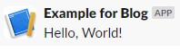

# On Guard, Slack Off
(Slack notifications for AWS GuardDuty findings)

Enabling AWS GuardDuty appears a quick win to improve cloud security.
But to be effective, cloud administrators need to be shown its findings quickly,
in order to evaluate them and take appropriate action.

At Bays Consulting, any GuardDuty findings pop up immediately in Slack;
in this blog I will sketch out how this has been achieved.

## Putting the Guard up
When building a secure cloud environment, you have no doubt given thought to a set of low-level controls
to prevent unauthorised access to resources and to limit the ability of compromised resources to communicate.
Expanding on this topic would of course provide material for many blogs,
but off the top of my head some familiar controls might include:
* requiring multi-factor authentication;
* restricting administrative permissions by the principle of least privilege;
* use of strong keys and encryption for connections and storage;
* whitelisting of ports and destinations to ensure only legitimate network traffic can pass.

To complement these foundational controls, a good security strategy should also include an element of smart monitoring,
seeking specific indicators of compromise while also keeping an eye out for anomalous changes in behaviour by a system or user.

AWS GuardDuty is a quick way to get that monitoring element in place.
As can be seen from the [published list of finding types](https://docs.aws.amazon.com/guardduty/latest/ug/guardduty_finding-types-active.html),
it is advertised as checking network and DNS logs against known malicious destinations,
for example IPs associated with Bitcoin mining. It also employs an element of Machine Learning to spot anomalous behavior,
such as a user logging in to the console from an unusual location.

Above all, for accounts with a small to medium volume of activity, it is cheap, probably just few dollars per month!

To enable it in your own AWS account, I would refer you to
[AWS's own documentation](https://docs.aws.amazon.com/guardduty/latest/ug/guardduty_finding-types-active.html).

## Notifications
Assuming you've enabled GuardDuty, you'll soon spot that, although findings can be browsed in the console,
there is no pre-built mechanism for notifying admins that attention is required, so you will need to set something up yourself.
One option is to alert users via a custom Slack integration, which I shall demonstrate here.

### Part 1: Slack-side
Firstly you will need to create an "App" in Slack.
You can think of this as a bot that can be added to specific Slack channels,
from which notifications will seem to appear.

* Head to the [Slack API Apps page](https://api.slack.com/apps)
* Hit "Create New App", and follow the "From scratch" pathway
* Choose a name for your app, and pick your organisation's Slack workspace for it to reside.

In order for an external service, i.e. AWS, to trigger the bot to send a message, you will need to create an "incoming webhook".
* On the left-hand-side menu, under Features, head to "Incoming Webhooks"
* If this is a new app, you will need to activate this feature with the big toggle switch
* Click "Add New Webhook to Workspace"
* Choose a channel in which notifications should appear; I would recommend creating a dedicated channel for security alerts.

You will see a Webhook URL is generated, which you should note down for later.

If you'd like to see the bot in action, you'll notice a sample `curl` command is shown in the API page.
Run this, and you should see a message coming in to your chosen Slack channel, looking something like this:

I'd suggest giving the bot a better icon than the default;
you'll find the relevant setting under "Basic Information" -> "Display Information".

### Part 2: AWS-side
Now the bot is ready and willing to send messages on a web push,
we need to configure AWS to send a push when a GuardDuty finding appears.

The architecture to enable that is as follows:

Each finding is published from GuardDuty into EventBridge (formerly CloudWatch Events).
From there, a rule is set up to invoke a custom Lambda function,
which then pushes the notification to the Slack Webhook over HTTPS.

To get this working, you will first need to create a new, empty Lambda function, using the Python 3 runtime.
At the time of writing, Python 3.9 was the latest supported runtime.

Now let's write some Python code to receive the GuardDuty finding and post a message to the Slack API.

We will of course need the Slack app's webhook URL.
Rather than hard-code this into the Lambda's source code, we can make the function reusable
by injecting this as an environment variable into the Lambda's runtime.
Head over to the "Configuration" tab, find "Environment variables", and add a new variable called `SLACK_URL`,
setting its value to the webhook URL we noted earlier.

Then in the function source, we can import some required modules, and then grab the URL from the environment:

    import boto3
    import json
    import os
    import urllib.request

    slack_url = os.environ["SLACK_URL"]

Next, because the Lambda function must call the Slack API over HTTPS,
I would normally reach for the popular Python `requests` library.
Sadly this does not come included in Lambda's Python runtime, so to avoid creating custom layers
there's a little bit of boilerplate code we often use at Bays Consulting, to post an object as JSON using only
the base Python `urllib` dependency:

    def do_post(url: str, body: dict):
        # convert input to a JSON string, and then convert to bytes using UTF-8 encoding
        json_bytes = json.dumps(body).encode('utf-8')
        
        # create a new HTTP request to the URL, add relevant headers, and send with body
        req = urllib.request.Request(url)
        req.add_header('Content-Type', 'application/json')
        req.add_header('Content-Length', str(len(json_bytes)))
        return urllib.request.urlopen(req, json_bytes)

Then we can join it all together in the Lambda's entrypoint function,
putting together some key information into a Slack message.

    def lambda_handler(event, context):
        account_id = event["account"]
        severity = event["detail"]["severity"]
        title = event["detail"]["title"]

        do_post(slack_url, {"text": f":warning: *{severity}*: *{account_id}*: {title} :warning:"})

Finally, we can wire the function up to GuardDuty, via EventBridge.

* Head to EventBridge -> Events -> Rules.
* Click "Create rule".
* Give the rule a name and description.
* Choose the option to build an "Event pattern" -> "Pre-defined pattern by service".
* Choose "AWS" as the Service provider, "GuardDuty" as the Service, and "GuardDuty Finding" as the Event type.
* You can leave the event bus section as is, which will use the defualt event bus.
* Under "Select targets", choose your previously created Lambda function.

You can now hit create, and the integration is active!

## How do I know it works?
It would be a little nerve-wracking to have to wait for an actual security incident
to test the notifications process is all working as expected. Fortunately, GuardDuty provides the option
to generate sample events at your leisure.

There is a button to generate these sample findings from the GuardDuty console, found under Settings.
This does generate rather a lot, so you may prefer to use the CLI, which can generate single samples, such as:

    aws guardduty create-sample-findings \
        --detector-id xxxxxxxxxxxxxxxxxxxxxxxxxxx  \
        --finding-types InitialAccess:IAMUser/AnomalousBehavior \
        --region eu-west-2

You can find the detector ID also on the Settings page.

## Icing the cake
There are couple of ways we might improve on this basic integration.

Firstly, GuardDuty integrates with AWS Organizations to enable monitoring on all your AWS accounts 
at the same time. You may therefore receive alerts from different accounts, and need quickly to understand
the source account in order to assess risk.

Personally I am incapable of remembering to which account the 12-digit account IDs correspond,
so I have extended the Lambda to query the AWS Organizations API,
translating the 12-digit ID into a readable account mnemonic:

    organizations_client = boto3.client('organizations')
    account_desc = organizations_client.describe_account(AccountId=account_id)['Account']
    account_name = account_desc['Name']

For this to work, the Lambda's execution role needs a little extra permission to describe member accounts:

    {
        "Version": "2012-10-17",
        "Statement": [
            {
                "Effect": "Allow",
                "Action": "organizations:DescribeAccount",
                "Resource": "arn:aws:organizations::*:account/o-*/*"
            }
        ]
    }

Secondly, although we can make use of standard Slack message formatting, 
including **bold**, _italic_ and emojis,
a single-line message is a bit restrictive. 
For a more richly formatted view, we can use Slack's [Block Kit](https://api.slack.com/block-kit/building),
to combine blocks of information into an attractive and clear message.
I've saved an example finding [here](example-finding.json) to see what fields might be available. 

The complete function source is available [here](lambda_function.py).
I would be interested to hear from anyone who has found this useful,
in particular to see what Block Kit formatting you have used! 

## Conclusion
In my opinion, a Slack integration provides a good way to get the team familiar with GuardDuty,
triaging the initial set of findings to tune out false positives, especially as the system learns
normal user behaviour.

As confidence in the system grows, and the findings become critical to the security policy,
other notification mechanisms might become more suitable.
Look out for a future blog on sending text messages for critical notifications!
