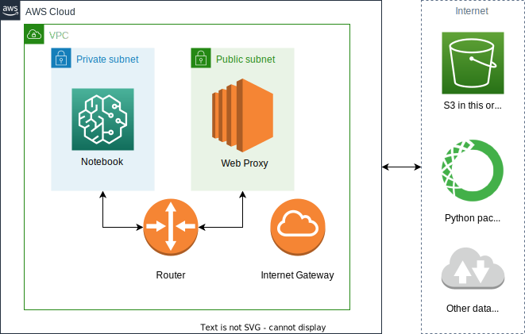

# SafeMaker
(Locking down internet access from Amazon SageMaker notebook instances)

When working with sensitive data, it's often important not to let that data leak onto user devices,
which can be lost or compromised.
Granting access to Amazon SageMaker notebooks is a quick way to collaborate securely on data analysis,
keeping all data stored and processed in a cloud environment.

But by default, SageMaker notebooks have full internet connectivity, allowing a poorly trained or malicious
partner to introduce unauthorised software to an instance or to exfiltrate data.

In this blog post, I will show how to put SageMaker notebooks behind a web proxy server,
allowing internet access to selected, legitimate domains only. 

## Overall architecture
The overall architecture is as follows:
* Web proxy software (squid) running on an EC2 instance in a public subnet
* SageMaker notebook deployed in a private subnet
* Web requests from SageMaker to allowlisted domains are proxied via squid

### What's a subnet?
When first getting to grips with AWS Virtual Private Cloud (VPC), I found the terms _private subnet_ and _public subnet_
a little baffling, as they seemed to imply that private subnets were locked away behind layers of control to make them "private".
In addition the concept seemed tightly coupled with whether instances in a subnet had a public IP address.

It's important to understand that a subnet is really just a block of IP addresses 
associated with a particular routing table. 
If the routing table for a subnet has a route to the VPC's Internet Gateway, 
then it's a public subnet.
Without such a route, traffic cannot be routed directly to the internet, making the subnet private.
It's as simple as that!

Of course, resources in a private subnet, such as our SageMaker notebook, will often need to access other content
from outside of the VPC, such as Python packages, or even AWS services such as S3 or DynamoDB.

Typically this is accomplished one of three ways:
1. **Network Address Translation (NAT)**: a NAT instance, either managed by AWS or self-managed,
can be created in a public subnet to translate requests from within the private subnet to the internet,
just as a home router grants effective internet access to devices inside the home. 
It's a bit tricky, however, to monitor and control what traffic is allowed other than at IP address/port level. 
2. **PrivateLink**: AWS and partner services, including S3, can be exposed as endpoints inside a private subnet, bypassing the internet. 
This is a very secure option as each endpoint can be associated with a specific policy describing what methods and resources may be access through it.
For S3, however, there is currently a limitation that only buckets from within the same AWS Region can be accessed.
3. **Web proxy**: at the application layer, web requests are sent to a web proxy in a public subnet. 
This is flexible while keeping strict control and logging over what domains may be accessed and with what HTTP methods.
I have chosen this method to illustrate today.

## Setting up your subnets
To realise the architecture described above, we will need at a minimum one private and one public subnet in a VPC.

You may like to create a brand new VPC from scratch using the wizard 
(go to VPC in the AWS Management Console and then click Launch VPC Wizard). 
This will create public and private subnets and required routing tables.
If following this route, do not provision a NAT Gateway
as this would effectively grant full internet access to SageMaker anyway (see above).

Alternatively, you may find it simpler to add a single private subnet to an existing VPC.
From the VPC console, go to "Subnets" and click "Create Subnet". 
You will need to choose a free CIDR block for IP address allocation. 
If creating this subnet inside the default VPC, you should find `172.31.48.0/20` is free.
Then go to "Route Tables", "Create route table", and pick a name and your VPC.
This should create a route table with a single entry, routing traffic for the VPC's CIDR to the 'local' destination: 
in other words, perfect for a private subnet since there is no route to an Internet Gateway!
From the "Subnet associations" tab you can explicitly associate this table with the newly created subnet.

## Setting up the web proxy
For security and performance, I would recommend a dedicated EC2 instance for the web proxy.
I won't go in to details on how to launch an EC2 instance as there are plenty of existing guides,
but a few points to note:
* I'm assuming you choose Amazon Linux as the operating system
* the instance should be in a public subnet and have a public IP address
* you can use an ARM-architected instance for this, such as `t4g.nano`, saving a bit of money
* put the instance into the VPC's default security group to allow access from SageMaker;
or for further hardening a more specific security group could be set up.
* for security, I would strongly recommend enabling only metadata version 2: 
see [here](https://aws.amazon.com/blogs/security/defense-in-depth-open-firewalls-reverse-proxies-ssrf-vulnerabilities-ec2-instance-metadata-service/) for a full discussion

Once your instance is launched, and you are connected as root,
issue the following commands to install `squid` web proxy:

    yum install -y squid
    systemctl enable squid
    systemctl start squid

By default, squid runs on port 3128, and allows proxy access to most common web ports.

We can lock this down further by editing the squid configuration file, `/etc/squid/squid.conf`.
We can create a list of allowlisted domains, at a location such as `/etc/squid/allowhttps.txt`,
and then add this list to the configuration file with a line such as:

    acl allowhttps dstdomain "/etc/squid/allowhttps.txt"

We can replace the line below, which allows all access from the local network:

    http_access allow localnet

With this line, which allows only access to the specific domains:

    http_access allow CONNECT localnet allowhttps SSL_ports

I've provided examples of a minimal, secured [squid.conf](squid-conf/squid.conf), 
[allowhttp.txt](squid-conf/allowhttp.txt), and [allowhttps.txt](squid-conf/allowhttps.txt) 

After modifying squid configuration, run the following to restart the service and reload configuration:

    systemctl restart squid

A final tip: you can monitor access and debug errors from the log file `/var/log/squid/access.log`.

## Setting up SageMaker
Now everything is ready for SageMaker. 

First we need a Lifecycle Configuration that applies proxy settings to a notebook.
In the "Start notebook" script, paste the following lines, replacing the private DNS placeholder:

    echo "#!/bin/sh" > /etc/profile.d/proxy.sh

    echo "export HTTP_PROXY=http://<private dns of the web proxy>:3128" >> /etc/profile.d/proxy.sh
    echo "export HTTPS_PROXY=http://<private dns of the web proxy>:3128" >> /etc/profile.d/proxy.sh
    echo "export NO_PROXY=169.254.169.254" >> /etc/profile.d/proxy.sh
    
    echo "export http_proxy=\$HTTP_PROXY" >> /etc/profile.d/proxy.sh
    echo "export https_proxy=\$HTTPS_PROXY" >> /etc/profile.d/proxy.sh
    echo "export no_proxy=\$NO_PROXY" >> /etc/profile.d/proxy.sh
    
    chmod a+rx /etc/profile.d/proxy.sh

This creates a new script inside the notebook instance, under `/etc/profile.d`.
These scripts are automatically run whenever a new shell is started in the instance,
which gives us a way to propagate the environment variables `HTTP_PROXY` and `HTTPS_PROXY` to all processes.

As well as setting the proxy destination, I've set an additional, important variable: `NO_PROXY`.
This is a list of domains or addresses to which software should connect directly, not through the proxy.
I've added the all-important metadata service, `169.254.169.254`, ensuring the notebook instance can continue
to access temporary credentials associated with its execution IAM role.

You'll notice I set both upper- and lower-case versions of these variables,
as there is some variation in what variables different software expects.

You can either create a new notebook instance, or modify an existing one.
Under "Network", pick your VPC and private subnet. 
To allow communication with the web proxy, pick the VPC's default security group, 
unless you are planning something more hardened (see above).

Finally, don't forget to associate the notebook with the lifecycle created above.

## Trying it out and next steps
I've tested this setup for a number of scenarios, including:
* Issuing `curl` commands from the terminal to allow-listed HTTP domains
* Running `pip install`
* Using `pandas` to read a CSV directly from S3

As you hit issues, check squid's `access.log` to see blocked domains,
and if you deem them legitimate they can be added

There are many ways this could be taken forward. 
I've mentioned the possibility of creating more specific Security Group rules.

I'd also strongly recommend putting the set up of the web proxy into an infrastructure-as-code system such as Terraform.
You could put the setup of `squid` into EC2 user data, 
with the allow lists pulled down from S3 or the Systems Manager parameter store.

You could investigate SSL decryption in the web proxy, to provide further auditing and filtering
even when the connection is via HTTPS.

In conclusion, the web proxy approach described in this blog can provide a level of control over what content
partners introduce to a SageMaker notebook instance, 
and a restriction of accidental or malicious exfiltration of data over the public internet. 

In a future blog I'd like to look at how SageMaker itself can be accessed through a reverse web proxy,
giving further controls over what data can be exfiltrated from the notebook onto a user's local machine.
