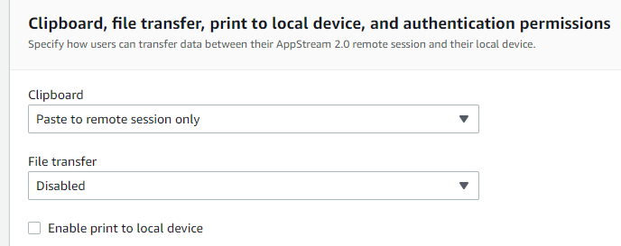

# Keeping it Cloudy
Downloading from interactive, secure portals while preserving data residency in the cloud.

## We love the cloud
At Bays Consulting, we prefer wherever possible to store and process our clients' data in the cloud,
typically the storage and compute components of Amazon Web Services.

Furthermore, for many of our projects we have contractually agreed requirement that data resides in the cloud at all times,
and is not copied to local employee machines. This generally has two motivations.

Firstly, data protection laws may impose specific geographical data residency requirements, such that personal data
remain within the UK or within the European Economic Area. Such residency requirements are well understood by cloud service providers;
in Amazon's case this in principally covered by the use of specific regions such as `Europe (London)`.

Secondly, the security controls applied to the cloud to monitor and prevent data loss, and to segregate client data, are well understood
and can be documented and audited by our customers.

In addition, keeping the data in the cloud is simply more practical for us, as we can there benefit from Amazon's resilience,
and apply a range of scalable approaches to interrogate and analyse the data; and at the end of the day, for an impatient person like me,
large datasets download too slowly over a home broadband connection!

## So what's the problem?
While the road is generally smooth once data is sitting in our cloud environment (typically Amazon S3), sometimes it's
not obvious how to get it there. 

For publicly available data, one can usually download data straight into a cloud environment by using a utility such as `curl`
from a terminal on a cloud virtual machine. Once on the virtual machine's local storage, another command will take care of
uploading it to S3 or equivalent blob storage.

Often however, a customer will grant us access to download the data from a secure portal, perhaps
a shared folder in Google Drive or Microsoft SharePoint, or some in-house or 3rd-party transfer site. It seems a new method comes
along every day!

Each of these secure web portals will typically have an interactive process for authentication, perhaps involving setting up
an account and often applying Multi-Factor Authentication. So how can we acquire the data directly into the cloud,
without first downloading to a laptop and then re-uploading?

## Avoiding the problem
In this situation, I always aim first to see if there is an alternative to the interactive web portal. 
As well as avoiding the issue of local copy to my laptop, having a direct cloud-to-cloud transfer method ensures
we can transition smoothly to a productionised data pipeline later, even if the current project only involves a single dump of data.

While there is no one-size-fits all approach, some ideas to consider might include:

* Generating some kind of magic link within the secure web portal, if allowed, that can be used directly with `curl`.
* Direct upload by the customer to Amazon S3; we can grant specific authorization to allow data upload to designated drop location,
  either for manual use or as part of a pipeline on the customer side.
* Download from a more headless, machine-friendly portal such as an SFTP site or a Samba mount.
* API or CLI download from the existing portal. 
  Typically, this will require some setup on the customer side to create an API key or equivalent. 
  Check out the following:
  * [CLI for Microsoft 365](https://github.com/pnp/cli-microsoft365)
  * [Google Drive API](https://developers.google.com/drive/api/guides/manage-downloads)

## OK, what else?
If it is not practical to establish one of the methods above, especially if this is a one-off transfer anyway,
we don't have to give up on keeping the data entirely within the cloud. We simply need to launch a web browser that is itself
running within the cloud, and navigate through the interactive download process there.

Since the browser software is running remotely, and all that we are seeing on our laptop is a stream of the pixels
shown on the interactive web portal, the downloaded data itself will never touch even the memory of our local machine.

There are a range of ways to achieve this, from fully managed solutions to more home-grown integrations.

### Amazon Workspaces Web
A recently launched service by Amazon, comprising a fully managed, cloud-hosted browser pixel-streamed to the desktop.

It relies on a SAML-based identity provider for authentication, which could be AWS IAM Identity Center 
(successor to AWS Single Sign-On) if you already have that set up. It can be set up inside a VPC, if you have
requirements to pass internet traffic through a particular NAT or proxy.

There are a few downsides, however.
* It's unclear how the local storage can be accessed, so you would need to re-upload data to S3 via the AWS console inside the browser.
* The pricing is rather off-putting, since you have to pay a certain amount per Monthly Active User, currently $8 in London,
  which makes it very expensive per hour compared to other options.

### Amazon AppStream 2.0
This is a related, but more generic AWS service, designed to stream a variety of applications running in the cloud.
Helpfully, the standard sample image includes Firefox running on a Windows Server backend, perfect for accessing an interactive portal.

As above, the resources can run inside a VPC, allowing access to local VPC endpoints and directing internet traffic
through a particular established route or proxy.

The pricing is much more attractive, being relatively high compared to a base EC2 instance but billed per hour. 
Users can be provisioned in a simple way, without needing to deal in SAML documents!

I gave this a go, creating a Stack and associated Fleet from the Amazon AppStream2 Sample Image.

I made myself a user with entitlements on the stack, immediately receiving an email to my inbox with instructions for 
completing the account set up. Confusingly, an error message popped up to say that I had no applications available,
but after waiting 10-15 minutes for the fleet to initialise fully, and then another couple of minutes to "prepare" my session,
I could open Firefox.

If deploying into a public subnet, one should enable **default internet access** to ensure the backing instance
gets a public IP address. In addition, I would recommend some additional hardening to prevent data loss:

The graphical performance is a little sluggish over my internet connection, but certainly good enough to navigate to OneDrive
and perform interactive authentication. The file download itself runs very fast, and once the downloaded file has been
moved manually to Home Folder it appears in S3, in a specially created bucket that backs the user's home directory,
from which it can be copied, if necessary, to the intended S3 bucket, 
using the [AWS S3 CLI](https://docs.aws.amazon.com/cli/latest/reference/s3/cp.html).

Overall it was a fairly user-friendly experience. The drawbacks for me are:
* From a security perspective, the standalone authentication process introduces a new attack service to worry about.
* I couldn't upload directly into the preferred S3 bucket.
* Although the cost is theoretically elastic, minimum charges and long initialisation times ran up a usage bill of $0.27,
  which is high compared to the home-made EC2 options below, and on top a whopping $4.19 Windows licencing charge (payable per month).

### Windows Server over RDP
Previously my preferred method, one can create a vanilla Windows Server virtual machine using Amazon EC2, billed per hour.

Once you have obtained the Administrator password from your SSH key, and opened up port 3389, you can
log straight in to the server's desktop using Remote Desktop Protocol.

For Windows to funtion properly you do need to allocate reasonable CPU and memory, which pushes the overall cost up
when the additional Windows software charge is included.

In addition, I find the process of getting online surprisingly inconvenient, 
since the built-in internet browser has so many access controls applied by default.
This has led me to favour one of the Linux-based options below.

### X11 over SSH
If you already have a Linux virtual machine running in the cloud, a venerable option for streaming applications to the desktop
is X11 forwarding over SSH.

Assuming you have an existing Amazon Linux instance, getting this up and running is quite simple,
and requires no additional authentication set up since the traffic is forwarded over existing SSH connection.

First you need to install the base X11 packages on your Amazon Linux server, by running

    sudo yum install xauth

Then you have a choice of installing Firefox or Chromium, according to taste, although Chromium is not currently available
in the EPEL repository for ARM.

    # Install Chromium
    sudo amazon-linux-extras install epel -y
    sudo yum install chromium

    # Install Firefox
    sudo amazon-linux-extras install firefox -y

Then you will need local X software, such as [Xming](https://sourceforge.net/projects/xming/), 
to display the browser window. I also find performance on Windows better with [PuTTY](https://www.putty.org/),
rather than the built-in OpenSSH client.

I won't detail the remaining steps to get this set up, as various online guides are available, and above all
because I have given up on this approach for reasons of performance. The browser is so slow to render over my home
internet connection that it is simply too painful to complete the interactive login process.
It may be that clever tuning of the graphics and SSH connection would resolve this, 
but I would recommend one of the approaches below.

### VNC over SSH
A more modern and comprehensive alternative to X11 forwarding, VNC software streams a complete graphical
desktop environment to your local machine.

You still need to install dedicated VNC software, such as [TigerVNC](https://tigervnc.org/)
on both client and server, but as with X11 above the connection can piggyback on existing virtual machine and SSH infrastructure,
which gives some peace of mind from a security perspective.

Amazon have provided a complete set of instructions [here](https://aws.amazon.com/premiumsupport/knowledge-center/ec2-linux-2-install-gui/).

### NICE DCV: the winner?
To evaluate the options so far, the VNC option wins on price and flexibility, but has the drawback that local software 
must be installed, which may not be feasible or even permitted depending on your organisation's policies. 
Amazon AppStream 2, on the other hand, provides an entirely web-based client, but at a significantly higher cost and lower flexibility.

It turns out that Amazon have made the underlying streaming technology for AppStream, 
[NICE DCV](https://docs.aws.amazon.com/dcv/latest/adminguide/what-is-dcv.html),
available at no additional cost when run on Amazon EC2, and it can even run over SSH forwarding.

The [installation process](https://docs.aws.amazon.com/dcv/latest/adminguide/setting-up-installing-linux.html)
for an existing Amazon Linux instance is prohibitively long, but there is a pre-built AMI available instead.

To get up and running, launch a new EC2 instance using either 
[NICE DCV for Amazon Linux 2](https://aws.amazon.com/marketplace/pp/prodview-ulbymol35e3ws) or
[NICE DCV for Amazon Linux 2 (ARM)](https://aws.amazon.com/marketplace/pp/prodview-lb5bojtkc3wv2)
depending on your choice of architecture. I ran a `t4g.small` Spot instance, costing less than $0.01 per hour.

There's no need to whitelist any ports other than SSH (22), as you can connect with a port forward of 8443,
which is used to serve the remote desktop, running something like:

    ssh -L 8443:localhost:8443 -i ~/.ssh/your-key.pem ec2-user@ec2-xx-xx-xx-xx.eu-west-2.compute.amazonaws.com

Once in to the instance with SSH, you will need to launch a new session by running:

    dcv create-session my-session

And set a password for the `ec2-user` by running 

    sudo passwd ec2-user

(Alternatively, you can disable password authentication by editing the configuration file `/etc/dcv/dcv.conf`.)

Then install a browser using one of the commands above, e.g.

    sudo amazon-linux-extras install firefox -y

Then using your local browser of choice, navigate to `http://localhost:8443`.
Bypass any certificate warnings (the whole connection is going over SSH anyway) and enter the `ec2-user` credentials set above.
Perform the interactive login and download, and then you can use the AWS CLI to upload from the local storage to S3.

#### Additional hardening
I am pleased with the discovery of this new approach. It is simple to deploy, extremely cost-effective, and a pleasure to use.
To make it even better for the security conscious, I would suggest applying some additional hardening.

Firstly, the DCV server listens by default for incoming external connections, but if using SSH forwarding this exposes
an unnecessary attack surface, albeit one hopefully protected by AWS Security Groups! 
To listen on loopback only, edit `/etc/dcv/dcv.conf` and set the following in the `[connectivity]` section;
you will need to restart the `dcvserver` daemon for the changes to take effect.

    web-listen-endpoints=['127.0.0.1:8443', '[::1]:8443']

Secondly, by default `ec2-user` has full administrative privileges, unnecessary for downloading and storing a file.
I would suggest creating a dedicated `dcv-user` without any privileges, and then launching the DCV session for that user.

Thirdly, to reduce accidental data loss, there are additional policies that you can apply to restrict file transfers
and clipboard access between the remote and local session. 
[This documentation](https://docs.aws.amazon.com/dcv/latest/adminguide/security-authorization-file-create.html)
gives some examples.

Finally, consider running automatic anti-malware scans of downloaded files. 
[This blog](https://docs.aws.amazon.com/dcv/latest/adminguide/security-authorization-file-create.html)
gives some pointers for setting up the free ClamAV scanner.

## Conclusion
Keeping sensitive data in the cloud at all times is a desirable and often mandatory goal.
While machine-friendly APIs and CLIs are the ideal vector to transfer data from one secure location to another,
for one-off data deliveries it may not be feasible to set one up.

By launching a secure browser in the cloud, perhaps using the NICE DCV protocol or another approach outined above, 
you can perform the required interactive login steps and download the data of interest.
