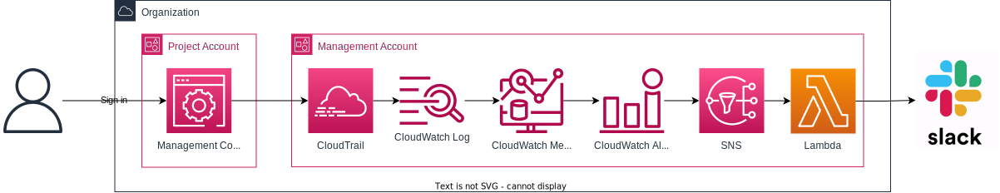
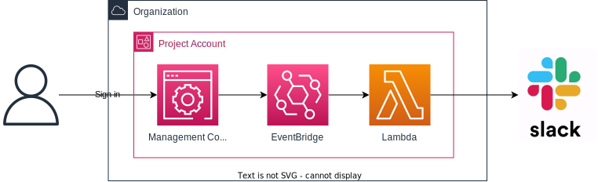
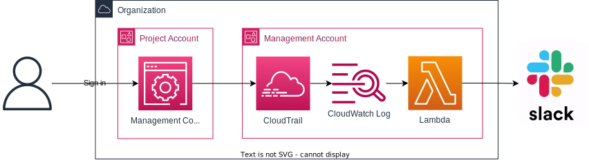

# CloudWatch and Watching the Cloud

## The need for simple alerts
When designing a security strategy, and particularly when implementing security monitoring,
one can easily fall into the trap of focussing exclusively on the more sophisticated, next-generation
monitoring at the expense of more basic alerts.

At Bays Consulting, we have been using GuardDuty for a while to help keep an eye out for unauthorized 
or other suspicious activity in our Amazon Web Services accounts.
GuardDuty integrates with audit logs captured by CloudTrail, analysing the stored events for anomalies,
such as a particular API invoked from a new location. The anomaly detection is proprietary, but one can
assume makes use of some reasonably sophisticated rules, machine learning, or artificial intelligence.

Some recent analysis of our security controls, however, threw up a gap at a much more basic level.
There are a whole host of login events or configuration changes that are sufficiently high-impacting
or potentially dangerous that they should guarantee an alert.

For example, we have streamlined our sign-in process to use single-sign on from Microsoft 365 via 
IAM Identity Center. Nevertheless, it remains theoretically possible to sign in using root credentials,
and indeed this is still required for a small number of administrative operations, 
documented [here](https://docs.aws.amazon.com/accounts/latest/reference/root-user-tasks.html).

If someone did sign in using root credentials, as a monitor of our cloud accounts I would like to be
immediately informed, so that I can verify the credentials have not been compromised, or, if the operation
can be achieved via the single-sign on route, to offer additional training to ensure users stick to approved channels.

So how can such rule-based alerts be implemented?

## Option 1: CloudTrail Metric Filters and Alarms

The officially sanctioned approach, as documented by AWS themselves [here](https://docs.aws.amazon.com/awscloudtrail/latest/userguide/cloudwatch-alarms-for-cloudtrail.html),
is rather convoluted. First, CloudTrail should be configured forward events to CloudWatch Logs.

Then within CloudWatch, a metric filter can be created that counts the number of log messages matching a particular pattern.
An alarm can be configured for when this metric exceeds zero, which will publish a notification to SNS.

Users can then receive notifications, either by subscribing their mobile directly to SNS for a text message,
or by running a custom Lambda to push notifications on to external systems such as Slack.

Apart from the obvious disadvantage of complexity, this approach has a number of additional frustrations.
First, the requirement for an alarm to track a metric over a period of time introduces a seemingly unnecessary 
and almost dangerous time delay into the alert process. 
Second, for small companies, there is a cost implication since both metrics and alarms beyond 
the free tier have a monthly cost, which adds up when all desired events are taken into account. 
Third, the alarm payload sent on by CloudWatch has no information from the actual events
that triggered the metric change, so any notification to a user will have minimal contextual information to allow triage of the alert.

In its defence, this approach is centralised, and can be extended to allow more sophisticated alert logic,
for example to alert on authentication failures only if 3 occur in a 5-minute window.

## Option 2: EventBridge Rules

A much simpler approach uses EventBridge. 
For each control, a rule can be created to match the activity of interest. 
The target for the rule can be a Lambda function to push on a notification to users.

Unlike the first option, events propagate quite quickly through EventBridge, allowing notifications to be received sooner.

Unfortunately there is a major disadvantage of this approach, if you are working in a multi-account environment.
Even when using an organization-wide CloudTrail setup, the audited events only appear in EventBridge within the same account in which they occurred.
So for this approach to work, the rules would need to be applied to each account individually. 
This is not insurmountable via an Infrastructure-as-Code approach, potentially combined with the use of AWS Control Tower,
but it is certainly an unsettling approach, and feels unnecessarily so since CloudTrail itself is well integrated with AWS Organizations.

## Option 3: Log Subscription Filter

The third option to consider returns to the centralized CloudWatch log populated by CloudTrail,
but rather than adding a metric filter uses a subscription filter to forward events of interest directly to a Lambda.

There is a fixed and very restrictive quota of subscription filters allowed on each log group,
so it would not be possible to write each control as its own filter. Nevertheless, a two-stage filtering approach
is possible whereby a single but perhaps slightly too broad pattern captures a set of events,
which can be further filtered in the Lambda code directly.

As the full CloudWatch log message is passed through to the Lambda, this approach allows 
a rich set of contextual information to be passed through to the end user.

## Conclusion

Although I've not said which approach found favour at Bays Consulting, you might be able to take a guess.
Each approach has certain trade-offs in response time, cost, complexity, and ease of deployment, and you will
need to consider how these may impact on your organisation.

Whichever approach you decide on, it will always be important to consider how to tune the alerts and 
to whom notifications should be sent, to avoid the ever present threat of an overwhelming number 
leading to alert fatigue: perhaps the subject of a future blog!
